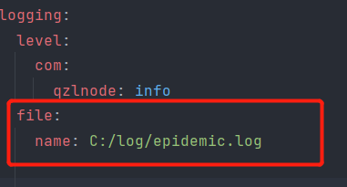

## 关于本项目
本项目为在线疫情防控系统,采用**SpringBoot+Jwt+Thymeleaf+Redis+Nginx**,该部分为后端部分。

## 提示

需要保证系统中有python的环境,且有着*requests*,*bs4*,*re*,*json*,*tqdm*,这些python库。

在/com/qzlnode/epidemic/miniprogram/other包中的[corona_virus_spider.py](https://github.com/InnocentEyes/Epidemic/blob/master/src/main/java/com/qzlnode/epidemic/miniprogram/other/corona_virus_spider.py) 便是获取疫情数据的脚本文件。

同时，在application.yaml中可以自己配置日志文件的位置:



环境是jdk1.8、mysql的版本是8.0.24,如果当前主机mysql的版本号与这里的版本号不一致的话，可以到[pom.xml](pom.xml)文件中修改*mysql-connector-java*中的版本号,
改成自己的版本号就可以了，当然前提条件是要搭配着[Maven](https://maven.apache.org/) 使用。

**Nginx** 可配可不配，这里默认采用轮询的负载均衡策略。


## 有关 API

### 全局API

`/all`:获取全国的省市区的json疫情数据，如下:
```
    //台湾的疫情数据
    {
        "provinceName": "台湾",
        "provinceShortName": "台湾",
        "currentConfirmedCount": 2131,
        "confirmedCount": 16721,
        "suspectedCount": 485,
        "curedCount": 13742,
        "deadCount": 848,
        "comment": "",
        "locationId": "710000",
        "statisticsData": "https://file1.dxycdn.com/2020/0223/045/3398299749526003760-135.json",
        "highDangerCount": 0,
        "midDangerCount": 0,
        "detectOrgCount": 0,
        "vaccinationOrgCount": 0,
        "cities": [],
        "dangerAreas": []
    },
```

`/login`: 用户登录的接口,登录成功会返回一个token,以及用户的部分信息。

`/register`: 用户注册的接口，注册成功会返回一个json数据:
```
{
    "code": 200,
    "message": "operation unsuccessful"
}
```
### miniprogram的API

`/mobile/send`: 用户在一个话题模块中发送言论。

`/mobile/comment/getInfo`: 获取一个话题所有的言论的json格式数据。

`/mobile/likes`: 用户为言论点赞。
    
...


